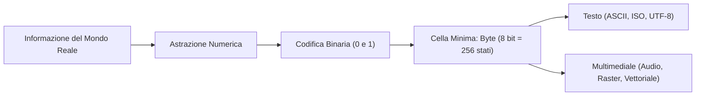

[[Home MOC|Home]] / [[Education & Learning]] / [[Lezione 0 - Rappresentazione dei Caratteri e Dati Multimediali]]

# Lezione 0 - Rappresentazione dei Caratteri e Dati Multimediali

## Sintesi Esecutiva
La comprensione della <mark style="background:rgba(255, 193, 69, 0.32)"><font color="#cc8800"><b>rappresentazione dell'informazione</b></font></mark> costituisce il fondamento architetturale su cui poggiano sia i calcolatori moderni che i linguaggi di alto livello. La lezione introduttiva del corso (Sapienza Università di Roma, DIAG — curata da D. Lembo, P. Liberatore, G. Santucci, A. Marchetti Spaccamela e M. Schaerf) formalizza la transizione dalla logica binaria pura alla codifica dei simboli testuali. Vengono analizzati l'alfabeto standard ASCII a 7 bit con i suoi caratteri di controllo, i limiti regionali dello standard esteso ISO-8859-1 ("la torre di Babele" delle code page), per poi culminare nell'universalità di **Unicode** e dell'efficiente schema di codifica a lunghezza variabile **UTF-8**, adottato nativamente da Python. La trattazione si estende infine alla digitalizzazione dei dati multimediali continui e discreti: campionamento e quantizzazione del suono, immagini raster nel formato didattico PPM e grafica vettoriale SVG.

## Fondamenti della Rappresentazione Digitale

Un calcolatore elettronico manipola unicamente due stati di tensione fisica, astratti matematicamente attraverso i due simboli elementari `0` e `1`, denominati **bit** (*binary digit*). Tutte le tipologie di informazione (testo, numeri, audio, immagini, video) devono pertanto essere tradotte in opportune sequenze di bit.

### Sistema Posizionale in Binario Puro
Il sistema numerico posizionale in base 2 associa a ciascuna stringa binaria di lunghezza $n$ un numero naturale attraverso la somma pesata delle potenze di 2:
$$N = \sum_{i=0}^{n-1} b_i \cdot 2^i$$
dove la cifra più a destra ($b_0$) rappresenta il **bit meno significativo** (*LSB*, Least Significant Bit, peso $2^0 = 1$) e quella più a sinistra ($b_{n-1}$) rappresenta il **bit più significativo** (*MSB*, Most Significant Bit, peso $2^{n-1}$).

Ad esempio, il numerale binario $1011_2$ corrisponde al valore decimale:
$$1 \cdot 2^0 + 1 \cdot 2^1 + 0 \cdot 2^2 + 1 \cdot 2^3 = 1 + 2 + 0 + 8 = 11_{10}$$

### Cella Elementare di Memoria: Il Byte
La dimensione minima indirizzabile della memoria centrale nei moderni calcolatori è il <mark style="background:rgba(181, 113, 255, 0.36)"><font color="#9a54c1"><b>byte</b></font></mark>, composto da una sequenza di 8 bit. Una cella da un byte ammette:
$$2^8 = 256 \text{ configurazioni distinte}$$
tali configurazioni possono rappresentare gli interi naturali compresi nell'intervallo $[0, 255]$ (corrispondenti in binario a `00000000` $\dots$ `11111111`). Per rappresentare domini numerici più ampi, le celle di memoria vengono concatenate in parole di 2, 4 o 8 byte (16, 32 o 64 bit).



## Evoluzione della Codifica dei Caratteri

Per memorizzare ed elaborare testo alfabetico, a ogni singolo carattere deve essere associato univocamente un numero naturale, memorizzato a sua volta in forma binaria.

### Codifica ASCII
La codifica **ASCII** (*American Standard Code for Information Interchange*) è stata pubblicata dall'ANSI nel 1968. Si tratta di un sistema a **7 bit**, in grado di generare $2^7 = 128$ configurazioni numeriche distinte, corrispondenti all'intervallo $[0, 127]$.

Nei sistemi di memoria basati sul byte a 8 bit, ogni codice ASCII viene memorizzato ponendo a `0` il primo bit (MSB):
$$\text{Formato byte ASCII: } 0 b_6 b_5 b_4 b_3 b_2 b_1 b_0$$

Esempi di mappatura:
- `'0'` $\to 48$ (in binario a 8 bit: `00110000`)
- `';'` $\to 59$ (in binario a 8 bit: `00111011`)
- `'E'` $\to 69$ (in binario a 8 bit: `01000101`)
- `'z'` $\to 122$ (in binario a 8 bit: `01111010`)

### Caratteri Speciali e di Controllo
All'interno della tabella ASCII, l'intervallo compreso tra $0$ e $31$, insieme al codice $127$, non rappresenta glifi stampabili a video, bensì <mark style="background:rgba(181, 113, 255, 0.36)"><font color="#9a54c1"><b>caratteri di controllo</b></font></mark> progettati originariamente per il pilotaggio di terminali e telescriventi:

| Codice | Acronimo | Denominazione | Ruolo Semantico |
| :---: | :---: | :--- | :--- |
| `0` | **NUL** | Null Character | Segnala la terminazione fisica di una stringa in memoria |
| `7` | **BEL** | Bell | Emette un segnale acustico hardware (*beep*) |
| `9` | **TAB** | Horizontal Tabulation | Inserisce una tabulazione orizzontale (`\t` in Python) |
| `10` | **LF** | Line Feed | Avanzamento verticale di riga (`\n` in Python; andata a capo Unix/macOS) |
| `13` | **CR** | Carriage Return | Ritorno del cursore/carrello a inizio linea (`\r`) |
| `17` | **DC1** | Device Control 1 | Richiesta di ripresa trasmissione (*XON*) |
| `19` | **DC3** | Device Control 3 | Richiesta di sospensione trasmissione (*XOFF*) |
| `127` | **DEL** | Delete | Cancellazione di un carattere |

#### La Disputa Storica del Ritorno a Capo
Nelle vecchie stampanti a rullo meccaniche, per andare a capo occorrevano due operazioni distinte:
1. Ruotare il rullo per far avanzare la carta di una linea (**Line Feed**, codice 10).
2. Riportare indietro la testina di stampa all'inizio del foglio (**Carriage Return**, codice 13).

Questa separazione meccanica ha prodotto divergenze storiche nei sistemi operativi:
- **Unix, Linux e macOS (dalla v10 in poi):** usano solo `LF` (codice 10, `\n`).
- **Windows / DOS:** usa rigorosamente la coppia `CR` + `LF` (codici `13 10`, `\r\n`).
- **Mac OS classico (fino alla v9):** usava solo `CR` (codice 13, `\r`).

### Limiti di ASCII e lo Standard ISO-IEC 8859
La codifica ASCII presenta un limite drastico: cattura unicamente l'alfabeto inglese privo di segni diacritici. Risultano assenti le lettere accentate italiane (`à`, `è`, `é`, `ì`, `ò`, `ù`), spagnole (`ñ`), tedesche (`ä`, `ö`, `ü`, `ß`), nonché gli alfabeti non latini (cirillico, greco, arabo, ebraico), gli ideogrammi orientali e simboli finanziari come l'euro (`€`).

Per superare tale vincolo mantenendo la retrocompatibilità, è stato introdotto lo standard **ISO-IEC 8859**, che sfrutta l'ottavo bit del byte (ponendo il bit più significativo a `1`). Questo mette a disposizione ulteriori 128 configurazioni ($[128, 255]$):
- Per coprire lingue diverse con soli 128 caratteri aggiuntivi, lo standard definisce 15 differenti sotto-tabelle regionali, chiamate **code page** (*codici nazionali*).
- **ISO-8859-1 (Latin-1 West European):** è la code page più diffusa, concepita per coprire la maggioranza delle lingue dell'Europa occidentale (italiano, spagnolo, francese, tedesco, norvegese).

#### Il Problema della "Torre di Babele"
Le diverse code page ISO-8859 sono reciprocamente incompatibili: lo stesso codice numerico superiore a 127 assume significati diversi in base al codice pagina attivo nel sistema operativo:
- Nel code page **ISO-8859-1** (Latin-1), il codice $253$ corrisponde alla lettera `ý` (y con accento acuto).
- Nel code page **ISO-8859-9** (Turco), lo stesso codice $253$ corrisponde alla lettera `ı` (i senza punto).

Poiché l'informazione del code page non è memorizzata all'interno del byte del file, l'apertura di un documento con un codice errato genera visualizzazioni illeggibili (*mojibake*). Inoltre, risulta impossibile redigere un unico testo contenente simultaneamente caratteri latini, greci, cirillici o arabi, e linguaggi con migliaia di ideogrammi (come il cinese o il giapponese) non possono comunque essere rappresentati su 8 bit.

---

## Lo Standard Universale Unicode e lo Schema UTF-8

Per risolvere definitivamente la frammentazione dei code page, il consorzio Unicode ha definito lo standard **Unicode** (noto anche come *Universal Coded Character Set*, UCS), un monumentale dizionario universale che assegna a ciascun simbolo, glifo o segno grafico un identificatore numerico univoco e globale denominato **code point**.

### Architettura dello Spazio dei Caratteri
Unicode organizza il proprio repertorio in **17 piani** (*planes*) da $65.536$ posizioni ciascuno ($2^{16}$):
$$\text{Spazio totale: } 17 \times 65.536 = 1.114.112 \text{ possibili codifiche}$$
Questo intervallo richiede **21 bit** effettivi per la numerazione (da `0x000000` a `0x10FFFF` in esadecimale). Il primo piano (Piano 0) è denominato *Basic Multilingual Plane* (BMP) e raccoglie la quasi totalità dei caratteri utilizzati nelle lingue vive moderne.

### Schemi di Codifica a Confronto
Unicode definisce il repertorio concettuale dei caratteri, mentre gli schemi di codifica (UTF) stabiliscono come tali numeri debbano essere serializzati in sequenze di byte fisici:
1. **UTF-32 (UCS-4):** codifica a lunghezza fissa di esattamente 32 bit (4 byte) per ciascun carattere. È semplice da indicizzare ma spreca un'enorme quantità di memoria e banda per testi a prevalenza latina.
2. **UTF-16:** codifica a lunghezza variabile che utilizza unità da 16 bit (1 o 2 word, pari a 2 o 4 byte).
3. <mark style="background:rgba(255, 193, 69, 0.32)"><font color="#cc8800"><b>UTF-8</b></font></mark>: schema a lunghezza variabile da 1 a 4 byte (da 8 a 32 bit). È lo standard universale dominante sul Web e la codifica predefinita di Python.

### Struttura Binaria di UTF-8
UTF-8 adotta un algoritmo di codifica ingegnoso:
- **Intervallo [0, 127] (ASCII puro):** è rappresentato con **un singolo byte** il cui primo bit è `0` (`0xxxxxxx`). La corrispondenza con l'ASCII a 7 bit è assoluta e trasparente al 100%.
- **Caratteri oltre il 127:** vengono memorizzati con sequenze da 2, 3 o 4 byte. Il primo byte della sequenza contiene tanti bit `1` consecutivi quanti sono i byte totali del carattere, seguiti da uno `0` delimitatore. Tutti i byte successivi di continuazione iniziano rigorosamente con i bit di prefisso `10`:

| Intervallo Code Point (Decimale) | Lunghezza in Byte | Byte 1 | Byte 2 | Byte 3 | Byte 4 |
| :---: | :---: | :---: | :---: | :---: | :---: |
| $0 - 127$ | 1 byte | `0xxxxxxx` | — | — | — |
| $128 - 2.047$ | 2 byte | `110xxxxx` | `10xxxxxx` | — | — |
| $2.048 - 65.535$ | 3 byte | `1110xxxx` | `10xxxxxx` | `10xxxxxx` | — |
| $65.536 - 1.114.111$ | 4 byte | `11110xxx` | `10xxxxxx` | `10xxxxxx` | `10xxxxxx` |

#### Vantaggi Architetturali di UTF-8
1. **Compattezza:** i testi occidentali occupano lo stesso identico spazio dell'ASCII, senza alcuno spreco di memoria.
2. **Auto-sincronizzazione (Self-synchronization):** nessun byte iniziale può iniziare con `10`, prefisso riservato unicamente ai byte di prosecuzione. Se si verifica una corruzione di trasmissione o si inizia a leggere un flusso a metà, il decodificatore può scartare i byte spuri e riagganciare la lettura corretta non appena incontra un byte che non inizia con `10`.

### Gestione dei Caratteri in Python
Python 3 adotta internamente lo standard Unicode UTF-8 per la gestione del tipo `str`. Le funzioni built-in dedicate alla traduzione tra simboli e code point sono:
- `ord(carattere)`: restituisce l'identificatore ordinale intero del carattere.
- `chr(intero)`: restituisce il carattere corrispondente a quel code point.

```python
# Mappatura UTF-8 / Unicode in Python
print(ord('A'))      # 65 (ASCII standard)
print(ord('è'))      # 232 (Carattere esteso latino su 2 byte in UTF-8)
print(ord('€'))      # 8364 (Simbolo valuta su 3 byte in UTF-8)
print(chr(8364))     # '€'
```

> [!IMPORTANT]
> **Distinzione tra Cifra Numerica e Codice Decimale:**
> In ASCII e UTF-8, le cifre da `'0'` a `'9'` sono mappate sui codici ordinali da `48` a `57`. Di conseguenza, il carattere `'0'` ha codice `48`, mentre il numero `0` corrisponde al carattere speciale `NUL` (terminatore di stringa).

---

## Rappresentazione di Stringhe in Memoria

Una stringa è una sequenza contigua di caratteri memorizzati ciascuno tramite il proprio codice numerico. Ad esempio, la stringa `'ciao a tutti!'` viene memorizzata in sequenza:

| Carattere | `c` | `i` | `a` | `o` | *spazio* | `a` | *spazio* | `t` | `u` | `t` | `t` | `i` | `!` | `\0` |
| :---: | :---: | :---: | :---: | :---: | :---: | :---: | :---: | :---: | :---: | :---: | :---: | :---: | :---: | :---: |
| **Codice Ordinale** | 99 | 105 | 97 | 111 | 32 | 97 | 32 | 116 | 117 | 116 | 116 | 105 | 33 | 0 |

Si nota che lo spazio corrisponde al codice `32`, mentre nei modelli a basso livello (come il linguaggio C) il valore `0` funge da sentinella terminatrice.

---

## Rappresentazione dei Dati Multimediali

I calcolatori digitali devono poter convertire grandezze continue della realtà fisica (onde sonore, radiazioni luminose) in informazioni binarie discrete.

### Suoni e Audio Digitale
Il suono è un'onda meccanica continua di pressione dell'aria che si propaga nel tempo. Per digitalizzarlo, si ricorre al processo di:
1. <mark style="background:rgba(255, 193, 69, 0.32)"><font color="#cc8800"><b>Campionamento</b></font></mark> (*Sampling*): la pressione dell'aria viene misurata a intervalli temporali regolari e frequenti. La frequenza tipica per registrazioni di qualità CD è $44.100\text{ Hz}$ ($44.1\text{ kHz}$) o $48.000\text{ Hz}$ ($48\text{ kHz}$).
2. <mark style="background:rgba(181, 113, 255, 0.36)"><font color="#9a54c1"><b>Quantizzazione</b></font></mark>: ciascuna ampiezza misurata viene approssimata al valore discreto più vicino e codificata in binario a un numero prefissato di bit (tipicamente 16 bit per 65.536 livelli di ampiezza, o 24 bit).

$$f_{\text{campionamento}} \ge 2 \cdot f_{\max}$$
In base al **Teorema di Nyquist-Shannon**, per ricostruire un segnale continuo senza perdite informative, la frequenza di campionamento deve essere almeno pari al doppio della massima frequenza udibile (essendo l'orecchio umano sensibile fino a circa $20\text{ kHz}$, una frequenza di campionamento di $44.1\text{ kHz}$ o $48\text{ kHz}$ risulta ottimale). L'uso di un numero finito di bit introduce un'inevitabile approssimazione (rumore di quantizzazione).

### Immagini Raster e il Modello RGB
La percezione visiva umana della luce policromatica può essere sintetizzata attraverso il modello additivo **RGB** (*Red, Green, Blue*), dove qualsiasi colore viene espresso come combinazione delle intensità di tre canali cromatici primari.

Un'<mark style="background:rgba(255, 193, 69, 0.32)"><font color="#cc8800"><b>immagine raster</b></font></mark> (o *bitmap*) è una matrice bidimensionale discreta di minuscoli elementi elementari denominati **pixel** (*picture element*):
- Ciascun pixel viene considerato come un blocco monocromatico omogeneo.
- Il colore di ogni pixel viene espresso mediante una tripletta di valori $(R, G, B)$ (in genere interi tra $0$ e $255$ codificati su 8 bit per canale, per un totale di 24 bit o $16.7$ milioni di colori, detto *True Color*).

#### Il Formato Didattico PPM (Portable Pixmap)
Il formato **PPM** (variante P3 in puro testo ASCII) illustra la meccanica elementare di memorizzazione raster:
```text
P3
3 3
100
100 0 0    0 100 0    0 0 100
0 0 0      100 100 0  100 0 100
0 100 100  50 50 50   100 100 100
```
La struttura comprende:
1. **Identificativo del formato (Magic Number):** `P3` (indica PPM a colori in testo ASCII).
2. **Dimensioni:** larghezza e altezza ($3 \times 3$, per un totale di 9 pixel).
3. **Massima intensità cromatica:** `100` (in questo esempio il valore massimo ammesso per ogni canale).
4. **Matrice dei pixel:** sequenza ordinata di triplette RGB per riga.

#### Approssimazione e Compressione Raster
La rappresentazione raster è approssimata: variazioni spaziali più piccole della dimensione del singolo pixel vengono eliminate, e le gradazioni di colore sono quantizzate su un numero finito di bit. Per limitare le enormi dimensioni dei file grezzi si applicano algoritmi di **compressione**:
- **Compressione Lossless (Senza Perdita):** riduce i dati sfruttando la ridondanza statistica tra pixel adiacenti (es. formati PNG, GIF).
- **Compressione Lossy (Con Perdita):** elimina le informazioni ad alta frequenza impercettibili alla vista umana per massimizzare il risparmio di spazio (es. JPEG).

### Immagini Vettoriali
A differenza della grafica raster, la <mark style="background:rgba(181, 113, 255, 0.36)"><font color="#9a54c1"><b>grafica vettoriale</b></font></mark> non memorizza una griglia rigida di pixel, ma definisce le immagini attraverso equazioni matematiche e primitive geometriche elementari (punti, segmenti, curve di Bézier, poligoni, archi, cerchi e testo).

Nei formati standard basati su testo XML come **SVG** (*Scalable Vector Graphics*), la grafica è codificata mediante tag dichiarativi:
```xml
<svg width="400" height="200">
  <polyline points="0,0 100,100" stroke="black" />
  <circle cx="80" cy="80" r="40" fill="blue" />
  <text x="20" y="80" stroke="#FF0000">Sapienza</text>
</svg>
```

#### Confronto Sinottico: Raster vs Vettoriale

| Proprietà Architetturale | Grafica Raster (Bitmap) | Grafica Vettoriale |
| :--- | :--- | :--- |
| **Unità Costituente** | Griglia finita di pixel | Primitive geometriche ed equazioni matematiche |
| **Scalabilità / Risoluzione** | Dipendente dalla risoluzione: ingrandire produce scalettatura (*pixelation*) | **Risoluzione infinita**: ridimensionabile a qualsiasi scala senza perdita di nitidezza |
| **Dimensione del File** | Proporzionale al numero totale di pixel e profondità di colore | Proporzionale alla complessità e al numero di figure geometriche |
| **Casi d'Uso Tipici** | Fotografie, riprese video, texture realistiche | Loghi, diagrammi tecnici, caratteri tipografici, icone e cartografia |
| **Formati Standard** | PNG, JPEG, GIF, PPM, WebP, BMP | SVG, EPS, PDF vettoriale |
