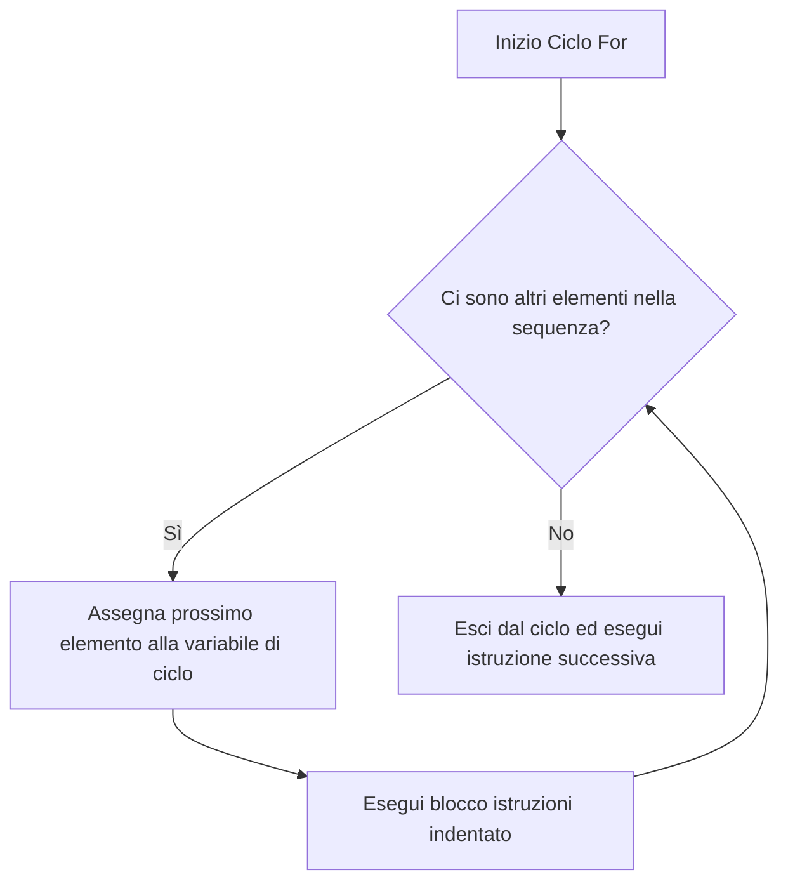
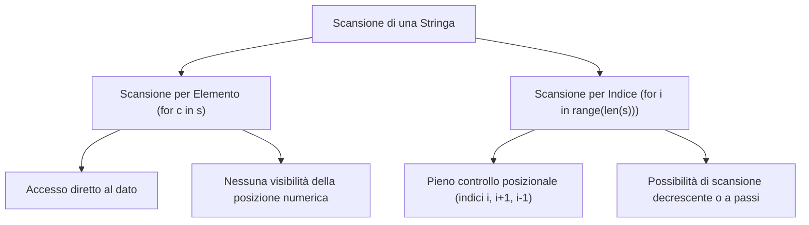

[[Home MOC|Home]] / [[Education & Learning]] / [[Lezione 4 - Ciclo For Sequenze e Variabili Accumulatore]]

# Lezione 4 - Ciclo For Sequenze e Variabili Accumulatore

## Sintesi Esecutiva
L'introduzione delle strutture di controllo iterativo segna il passaggio dall'esecuzione puramente sequenziale alla capacità di automatizzare compiti ripetitivi su insiemi finiti di dati. Questa quarta lezione didattica (Sapienza Università di Roma, DIAG — a cura dei proff. D. Lembo, A. Poggi, G. Santucci e M. Schaerf) formalizza l'istruzione <mark style="background:rgba(255, 193, 69, 0.32)"><font color="#cc8800"><b>for</b></font></mark> in Python, concepita come un iteratore deterministico su sequenze di valori. Viene esaminato il contrasto paradigmatico con il ciclo `for` a contatore del linguaggio C, per poi esplorare la funzione generatrice `range()`, il suo isomorfismo strutturale con lo slicing delle stringhe, il dualismo tra scansione per elemento e scansione per indice posizionale, la generazione a video di figure geometriche elementari e la formalizzazione algoritmica del <mark style="background:rgba(181, 113, 255, 0.36)"><font color="#9a54c1"><b>pattern dell'accumulatore</b></font></mark> sia su domini numerici che su sequenze di testo.

## L'Istruzione For e il Paradigma Iterativo

Tutti i linguaggi di programmazione imperativi prevedono costrutti di ciclo per ripetere l'esecuzione di un blocco di istruzioni. In Python, il ciclo `for` non è governato da una condizione booleana astratta, bensì dalla visita ordinata degli elementi appartenenti a una **sequenza finita di valori**: il ciclo viene eseguito esattamente un numero di volte pari alla lunghezza della sequenza fornita.

### Sintassi e Regole di Indentazione
La struttura sintattica dell'istruzione si articola come segue:

```python
for variabile in sequenza_di_valori:
    istruzione_1
    istruzione_2
    # ...
    istruzione_n
istruzione_successiva_al_for
```

1. **Variabile di Ciclo:** È un identificatore simbolico scelto dal programmatore che, ad ogni iterazione, assume automaticamente il riferimento all'elemento successivo della sequenza.
2. **I Due Punti (`:`):** Delimitano l'intestazione del ciclo e introducono il blocco di codice subordinato.
3. **Indentazione Semantica:** In Python non esistono parole chiave o parentesi per delimitare l'inizio e la fine dei blocchi. Tutte le istruzioni da eseguire all'interno del ciclo devono essere **allineate verticalmente con precisione** (convenzionalmente 4 spazi). L'uscita dal ciclo e la continuazione del flusso ordinario del programma si ottengono ripristinando il livello di indentazione della parola chiave `for`.



### Ciclo di Vita della Variabile di Iterazione
Ad ogni passo dell'iterazione:
- La variabile assume il valore successivo prelevato dalla sequenza;
- Viene eseguito integralmente il blocco di istruzioni indentato;
- Quando l'ultimo elemento è stato elaborato, il ciclo termina e il controllo passa all'istruzione successiva.

La variabile di ciclo può essere impiegata in due modalità distinte:
1. **Come indicatore di frequenza (puro contatore):** il corpo del ciclo esegue azioni che non dipendono dal valore assunto dalla variabile (es. stampare una costante fissa $n$ volte).
2. **Come operando di computazione:** il valore associato alla variabile viene attivamente letto, manipolato o impiegato per effettuare calcoli ed elaborazioni.

```python
# Uso della variabile come operando di computazione
for c in 'pippo':
    print(c, ord(c))  # Stampa il carattere e il suo code point UNICODE
```

---

## Iterazione su Sequenze Predefinite: Stringhe e Liste

In Python, qualsiasi tipo di dato che implementi il protocollo di sequenza può essere scandito direttamente tramite `for`.

### Iterazione Diretta su Stringhe
Poiché una stringa è una sequenza immutabile e ordinata di caratteri (studiata in [[Lezione 3 - Stringhe Metodi e Slicing]]), il ciclo `for` può scorrerla glifo per glifo senza richiedere la gestione esplicita di indici numerici:

```python
s = 'casetta'
for c in s:
    print(c)  # Stampa ciascun carattere su una riga distinta
```

La sequenza può essere fornita anche sotto forma di costante letterale:
```python
for c in 'Sapienza':
    print(c)
```

### Iterazione su Liste
Una sequenza può essere specificata esplicitamente mediante la sintassi a parentesi quadre `[valore1, valore2, ..., valoren]`, che definisce una **lista** Python. A differenza delle stringhe (che contengono solo caratteri), le liste possono aggregare oggetti eterogenei:

```python
# Iterazione su lista eterogenea
for elem in [7, 'pippo', 5.7, 'casa']:
    print(elem)

# Iterazione su collezione lessicale (nomi dei mesi)
for mese in ["gennaio", "febbraio", "marzo", "aprile", "maggio", "giugno",
             "luglio", "agosto", "settembre", "ottobre", "novembre", "dicembre"]:
    print(mese)
```

---

## Modello a Confronto: Python For vs Linguaggio C

L'approccio di Python al costrutto `for` differisce profondamente da quello dei linguaggi compilati tradizionali a basso livello, come il **C**. Nel linguaggio C, il ciclo `for` è essenzialmente una forma contratta di un ciclo `while` condizionale basato su aritmetica dei puntatori o contatori scalari.

### Codice a Confronto: Stampa dei Numeri da 1 a 5

**In Python:**
```python
for i in [1, 2, 3, 4, 5]:
    print(i)
```

**In C:**
```C
int i;
for (i = 1; i <= 5; i = i + 1) {
    printf("%d\n", i);
}
```

### Quadro Comparativo dei Paradigmi

| Criterio Architetturale | Linguaggio C | Linguaggio Python |
| :--- | :--- | :--- |
| **Tipizzazione delle Variabili** | **Statica e Obbligatoria:** la variabile di controllo `i` va dichiarata prima dell'uso (`int i;`) e non può mutare tipo nel tempo. | **Dinamica:** la variabile di ciclo viene associata automaticamente all'oggetto corrente della sequenza. |
| **Sintassi di Chiusura e Blocchi** | Istruzioni terminate con punto e virgola `;`. Blocchi racchiusi tra parentesi graffe `{ ... }`. L'indentazione è puramente visiva. | Delimitazione tramite due punti `:` e **indentazione obbligatoria**. Nessun punto e virgola. |
| **Logica di Controllo** | **Ciclo a contatore manuale:** tre clausole separate `(inizializzazione; guardia logica; incremento)` valutate ad ogni salto. | **Iteratore su collezione:** il ciclo consuma gli elementi di un contenitore o generatore fino a esaurimento naturale. |
| **Flessibilità di Esecuzione** | Scrittura orizzontale compatta consentita su riga singola senza vincoli di spaziatura. | Sintassi strutturata: `for ...: print(i)` su riga singola non consente blocchi composti. |

---

## Generazione Dinamica di Sequenze con range()

Creare manualmente elenchi estesi (ad esempio una lista di numeri da 1 a 100) comporterebbe un consumo ingiustificato di codice e memoria. Python risolve il problema tramite la funzione built-in <mark style="background:rgba(255, 193, 69, 0.32)"><font color="#cc8800"><b>range()</b></font></mark>, che genera sequenze numeriche aritmetiche su richiesta (*lazy evaluation*).

### Le Tre Firme di Invocazione di range()

1. **Firma Monoparametrica `range(stop)`:**
   Genera tutti i numeri naturali interi compresi tra $0$ (incluso) e `stop` (**escluso**):
   $$\{0, 1, 2, \dots, \text{stop}-1\}$$
   ```python
   list(range(5))  # Produce [0, 1, 2, 3, 4]
   ```

2. **Firma Biparametrica `range(start, stop)`:**
   Genera gli interi compresi tra `start` (incluso) e `stop` (**escluso**):
   $$\{\text{start}, \text{start}+1, \dots, \text{stop}-1\}$$
   ```python
   # Stampa dei numeri da 1 a 100 estremi inclusi
   for i in range(1, 101):
       print(i)
   ```

3. **Firma Triparametrica `range(start, stop, step)`:**
   Genera una progressione aritmetica con passo `step` specificato tra un valore e il successivo:
   ```python
   # Passo positivo crescente
   list(range(5, 22, 3))   # Produce [5, 8, 11, 14, 17, 20]

   # Passo negativo decrescente (start deve essere strettamente maggiore di stop)
   list(range(21, 5, -2))  # Produce [21, 19, 17, 15, 13, 11, 9, 7]
   ```

> [!NOTE]
> **Efficienza di Memoria dell'Oggetto `range`:**
> In Python 3, `range()` non restituisce una lista completa allocata in memoria, ma un oggetto iterabile immutabile che occupa uno spazio costante $O(1)$, calcolando i valori "al volo" solo quando richiesto dal ciclo. Per visualizzarne la rappresentazione estesa si utilizza la funzione di conversione `list(range(...))`.

### Isomorfismo tra range() e lo Slicing di Stringhe
Esiste un perfetto parallelismo concettuale e sintattico tra la funzione `range(i, j, n)` e l'operazione di **slicing** `s[i:j:n]` introdotta in [[Lezione 3 - Stringhe Metodi e Slicing]]:
- In entrambi i contesti, il primo argomento indica l'indice di partenza (incluso);
- Il secondo argomento definisce il limite di arresto (escluso);
- Il terzo argomento specifica il passo e la direzione dello scorrimento.

```python
s = "paperopoli"
print(s[1:8:2])                   # 'aprp'
print(list(range(1, 8, 2)))        # [1, 3, 5, 7]

# Inversione di una stringa e corrispondenza negli indici
print(s[::-1])                     # 'iloporepap'
print(list(range(len(s)-1, -1, -1)))  # [9, 8, 7, 6, 5, 4, 3, 2, 1, 0]
```

---

## Schemi di Scansione di Stringhe: Per Carattere vs Per Indice

La scansione dei caratteri all'interno di una stringa può essere impostata secondo due pattern algoritmici alternativi, ciascuno caratterizzato da specifici compromessi:



### 1. Scansione Diretta per Carattere
La variabile di ciclo riceve direttamente il singolo carattere:
```python
s = input("Inserisci una stringa: ")
for c in s:
    print(c, "=", ord(c))
```
- **Vantaggi:** Codice altamente conciso, elegante ed espressivo; accesso immediato al contenuto.
- **Svantaggi:** Totale assenza dell'indice numerico di posizione; impossibilità di esaminare elementi adiacenti (`s[i-1]` o `s[i+1]`) o di scorrere la stringa in senso inverso.

### 2. Scansione Posizionale per Indice
Il ciclo itera sugli indici generati da `range(len(s))`, accedendo al carattere mediante operatore di indicizzazione `s[i]`:
```python
s = input("Inserisci una stringa: ")
for i in range(len(s)):
    print(s[i], "=", ord(s[i]))
```
- **Vantaggi:** Piena consapevolezza della posizione numerica di ciascun carattere; possibilità di accedere contemporaneamente a elementi contigui o di percorrere la sequenza a salti.
- **Svantaggi:** Sintassi più verbosa.

### Applicazione: Scansione di una Stringa in Ordine Inverso
Per stampare a video i caratteri di una stringa dal fondo verso la cima senza ricorrere allo slicing, la scansione per indice decrescente risulta fondamentale:
```python
s = input("Inserisci la stringa: ")

# range genera valori da len(s)-1 scendendo fino a 0 compreso (-1 escluso)
for i in range(len(s) - 1, -1, -1):
    print(s[i])
```

---

## Applicazioni Algoritmiche: Disegno di Figure Geometriche

La combinazione dell'istruzione `for` con l'operatore aritmetico di moltiplicazione applicato alle stringhe (`str * int`, che produce la concatenazione ripetuta della stringa per il moltiplicatore) consente di costruire generatori di pattern geometrici a terminale.

### Disegno di un Quadrato Pieno
Dato un numero intero $l$ che rappresenta la dimensione del lato, il programma ripete per $l$ volte la stampa di una riga formata da $l$ asterischi:

```python
l = int(input("Inserisci lato del quadrato: "))

for i in range(l):
    print("*" * l)

# Variante analitica a riga singola senza ciclo esplicito:
# print(('*' * l + '\n') * l, end='')
```

### Disegno di un Triangolo Rettangolo Isoscele
Dato un intero $ct$ corrispondente alla misura dei due cateti, il programma stampa $ct$ righe successive con un numero crescente di asterischi pari a $i + 1$:

```python
ct = int(input("Inserisci lunghezza dei cateti: "))

for i in range(ct):
    print("*" * (i + 1))
```

Se $ct = 4$, l'output prodotto a video è:
```text
*
**
***
****
```

---

## Il Pattern della Variabile Accumulatore

Un'esigenza centrale nella programmazione procedurale consiste nel calcolare risultati che non possono essere dedotti in un singolo passaggio logico, bensì mediante un processo incrementale di aggregazione. Si definisce <mark style="background:rgba(255, 193, 69, 0.32)"><font color="#cc8800"><b>variabile accumulatore</b></font></mark> una locazione di memoria inizializzata prima dell'ingresso nel ciclo, aggiornata ad ogni iterazione con un valore parziale, e che al termine del ciclo conterrà il risultato complessivo ricercato.

### Struttura Generale del Pattern
```text
accumulatore = valore_neutro
per ciascun elemento nella collezione:
    accumulatore = accumulatore <operazione> contributo(elemento)
restituisci o stampa accumulatore
```

### 1. Accumulatore Numerico di Somma
Nel calcolo della sommatoria dei numeri interi compresi tra due estremi $n_1$ e $n_2$ inclusi:
- L'accumulatore `somma` viene inizializzato al valore neutro dell'addizione (`0`);
- Ad ogni iterazione, la variabile assume il valore del termine corrente e lo accumula;
- Al termine del ciclo `somma` contiene il totale definitivo.

```python
n1 = int(input("Inserisci l'estremo inferiore: "))
n2 = int(input("Inserisci l'estremo superiore: "))
somma = 0

for num in range(n1, n2 + 1):
    somma = somma + num  # Oppure operatore composto: somma += num

print("Somma calcolata =", somma)
```

### 2. Statistiche e Media Campionaria con Generatore Pseudo-Casuale
Il pattern ad accumulatore consente di raccogliere metriche descrittive su flussi di dati generati stocasticamente. Il seguente programma genera $rip$ numeri casuali nell'intervallo $[0, n]$ tramite la funzione `randint()` del modulo `random` e ne calcola la media empirica:

```python
from random import randint

somma = 0
n = int(input("Inserisci il limite superiore di variabilità: "))
rip = int(input("Inserisci il numero di ripetizioni: "))

for i in range(rip):
    num = randint(0, n)
    somma += num

media = somma / rip
print("Valore medio dei numeri casuali =", media)
```

### 3. Accumulatore di Stringhe (Trasformazione e Cifratura UNICODE)
Nelle elaborazioni testuali, l'accumulatore viene inizializzato con una stringa vuota `""` e aggiornato tramite l'operatore di concatenazione `+=`.

Il programma che segue trasforma una stringa inserita dall'utente, producendo una nuova stringa in cui ciascun carattere è sostituito con il carattere immediatamente successivo nella tabella dei codici ordinali UNICODE (traslazione affine analoga a un cifrario di Cesare elementare):

```python
s = input("Immetti una stringa: ")
s1 = ""  # Accumulatore inizializzato a stringa vuota

for c in s:
    prox = chr(ord(c) + 1)  # Calcola il carattere successivo
    s1 += prox             # Accumula per concatenazione

print("Stringa trasformata:", s1)
```

---

## Laboratorio ed Esercizi Risolti

Di seguito viene formalizzata la risoluzione rigorosa dei tre esercizi pratici proposti nel quaderno didattico.

### Esercizio 1: Somma dei Termini della Serie Armonica
**Specifica:** Scrivere un programma che calcoli la somma dei primi $m$ termini della serie armonica per un dato valore $m$ letto da tastiera:
$$H_m = \sum_{k=1}^m \frac{1}{k} = 1 + \frac{1}{2} + \frac{1}{3} + \dots + \frac{1}{m}$$

**Soluzione Implementativa:**
```python
m = int(input("Inserisci il numero di termini m: "))
armonica = 0.0  # Accumulatore in virgola mobile

for k in range(1, m + 1):
    armonica += 1.0 / k

print(f"Somma dei primi {m} termini della serie armonica = {armonica}")
```

### Esercizio 2: Somma dei Codici UNICODE di una Stringa
**Specifica:** Scrivere un programma che prenda in input una stringa da tastiera e calcoli la somma dei codici UNICODE ordinali di tutti i caratteri che la compongono.

**Soluzione Implementativa:**
```python
testo = input("Inserisci una stringa: ")
somma_codici = 0  # Accumulatore intero

for carattere in testo:
    somma_codici += ord(carattere)

print(f"Somma totale dei codici UNICODE per '{testo}' = {somma_codici}")
```

### Esercizio 3: Generazione della Tabellina Moltiplicativa
**Specifica:** Scrivere un programma che stampi a video la tabellina ordinata (da 1 a 10) di un numero intero inserito dall'utente.

**Soluzione Implementativa:**
```python
num = int(input("Inserisci un numero tra 1 e 10: "))

print(f"--- Tabellina del {num} ---")
for fattore in range(1, 11):
    risultato = num * fattore
    print(f"{num} x {fattore} = {risultato}")
```
